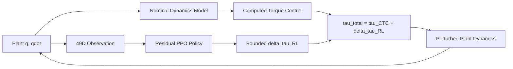

# Robust Manipulator Trajectory Tracking with Model-Based Control and Residual Reinforcement Learning

MuJoCo mechanical arm control and Residual RL robust trajectory tracking.

This project studies whether a bounded Residual PPO policy can compensate trajectory-tracking errors caused by inertial model mismatch while retaining a model-based Computed Torque Controller as the primary controller.

## Overview

Computed Torque Control (CTC) tracks joint trajectories extremely well when the dynamics model is accurate. Under plant/model mismatch, especially end-effector inertial mismatch, the same nominal controller degrades.

The final controller is:

```text
tau_total = tau_CTC + delta_tau_RL
```

CTC remains the main controller. PPO outputs only a limited residual torque correction. The policy does not observe the true plant inertial scale.

## Key Idea



The plant and nominal dynamics are intentionally separated. Plant inertia is perturbed during mismatch experiments, while the controller computes inverse dynamics from the nominal model.

## Classical Control Foundation

The project builds up the control stack in phases:

- Direct-torque Panda model derived from MuJoCo Menagerie.
- Joint-space PD and PD + gravity compensation.
- Quintic HOME -> TARGET -> HOME trajectory tracking.
- Computed Torque Control using MuJoCo mass matrix and bias terms.
- Dual-model model-mismatch benchmark.
- Optional Cartesian impedance module for classical-control exploration.

## Model Mismatch Benchmark

Nominal CTC is near-perfect:

```text
Nominal overall RMSE = 2.389e-05 rad
Nominal motion RMSE  = 2.792e-05 rad
```

End-effector inertial mismatch causes clear CTC degradation:

| Inertial scale | CTC overall RMSE | CTC motion RMSE |
|---:|---:|---:|
| 1.00 | 0.00002389 | 0.00002792 |
| 1.25 | 0.01368397 | 0.01410428 |
| 1.50 | 0.02591773 | 0.02667415 |
| 1.75 | 0.03700884 | 0.03803673 |
| 2.00 | 0.04722092 | 0.04847359 |

The nominal model is not modified by plant perturbations.

## Residual PPO

Final algorithm: Residual PPO v3.

Observation, 49D:

```text
q, qdot, q_des, qdot_des, qddot_des, q_des - q, qdot_des - qdot
```

Action:

```text
7D normalized residual action in [-1, 1]
```

Residual torque limits:

```python
[8.0, 8.0, 8.0, 8.0, 1.2, 1.2, 1.2]  # Nm
```

Training distribution:

```text
P(scale = 1.00) = 0.25
P(scale ~ Uniform(1.25, 1.75)) = 0.75
```

Reward:

```text
reward =
    - 1.0   * p_position
    - 0.1   * p_velocity
    - 0.03  * p_action
    - 0.005 * p_smooth
```

## Final 3-Seed Results

Seeds: `7, 17, 27`. All results use the fixed-budget final model, not best-checkpoint selection.


| Scale | CTC motion RMSE | Residual PPO mean | Residual PPO std | Mean improvement |
|---:|---:|---:|---:|---:|
| 1.00 | 0.00002792 | 0.00938740 | 0.00286179 | nominal n/a |
| 1.25 | 0.01410428 | 0.00931118 | 0.00113405 | 33.98 +/- 8.04% |
| 1.50 | 0.02667415 | 0.01213153 | 0.00036747 | 54.52 +/- 1.38% |
| 1.75 | 0.03803673 | 0.01632130 | 0.00049746 | 57.09 +/- 1.31% |
| 2.00 | 0.04847359 | 0.02099074 | 0.00098092 | 56.70 +/- 2.02% |

Raw per-seed motion RMSE:

| Scale | Seed 7 | Seed 17 | Seed 27 |
|---:|---:|---:|---:|
| 1.00 | 0.00867985 | 0.01253659 | 0.00694576 |
| 1.25 | 0.00885348 | 0.01060255 | 0.00847750 |
| 1.50 | 0.01198066 | 0.01255042 | 0.01186351 |
| 1.75 | 0.01626917 | 0.01684278 | 0.01585196 |
| 2.00 | 0.02092464 | 0.02200304 | 0.02004454 |

## Interpretation

Residual PPO improves all three seeds at the medium and strong inertial mismatch settings:

- `scale=1.50`: all seeds improve over CTC, mean improvement `54.52 +/- 1.38%`.
- `scale=1.75`: all seeds improve over CTC, mean improvement `57.09 +/- 1.31%`.
- `scale=2.00`: all seeds improve outside the training range, mean improvement `56.70 +/- 2.02%`.

The residual stays small relative to total torque. At `scale=1.50`, residual RMS / total torque RMS is about `4.48%` on average. There was no total torque clipping or residual action saturation in the final deterministic evaluations.

## Known Limitation: Nominal-Policy Interference

At `scale=1.00`, nominal CTC is nearly perfect. Residual PPO still outputs nonzero residual torque and therefore performs worse than CTC:

```text
CTC motion RMSE                 = 0.00002792
Residual PPO mean motion RMSE   = 0.00938740 +/- 0.00286179
Nominal safety guard            = 0.005 rad
Guard-passing seeds             = 0 / 3
```

This limitation is not hidden. Nominal-aware training and action regularization reduced the issue during development, but the final memoryless policy does not fully eliminate nominal interference.

Potential future work, not implemented here:

- history-based or recurrent residual policy,
- explicit online system identification,
- broader but controlled uncertainty estimation.

## Development Notes

Residual PPO development was intentionally stopped after v3:

- v1 trained only on mismatch and strongly degraded nominal tracking.
- v2 added nominal episodes and reduced nominal degradation.
- v3 increased residual action regularization from `0.01` to `0.03`.
- Nominal interference was reduced but not eliminated, so it is reported as a limitation instead of continuing a reward sweep.

## Repository Structure

```text
robot_control_mujoco/
├── controllers/
├── trajectories/
├── envs/
├── robustness/
├── train/
├── evaluate/
├── experiments/
├── scripts/
├── tools/
├── docs/
├── results/
├── README.md
├── requirements.txt
└── .gitignore
```

## Installation

Tested with Python 3.11 and MuJoCo 3.11.0.

```bash
conda create -n robot_control_mujoco python=3.11
conda activate robot_control_mujoco
pip install -r requirements.txt
```

The Panda model is derived from MuJoCo Menagerie. Clone Menagerie outside normal Git tracking:

```bash
mkdir -p assets
git clone https://github.com/google-deepmind/mujoco_menagerie.git assets/mujoco_menagerie
python tools/prepare_torque_model.py
```

Do not modify the upstream Menagerie files. The generated torque model keeps the source attribution files from the Panda model directory.

## Reproduce

Prepare the torque model:

```bash
python tools/prepare_torque_model.py
```

Validate core dynamics:

```bash
python scripts/validate_dual_model_ctc.py
python scripts/validate_residual_env_v3.py
```

Run final multi-seed evaluation, training only missing seed artifacts:

```bash
python scripts/reproduce_final_results.py --train-missing --seeds 7 17 27
```

Aggregate existing results only:

```bash
python scripts/reproduce_final_results.py --evaluate-only --seeds 7 17 27
```

## Results Artifacts

Final public-facing artifacts:

- `results/final_multiseed/aggregate/final_results.json`
- `results/final_multiseed/aggregate/final_results.csv`
- `results/final_multiseed/aggregate/per_seed_results.csv`
- `results/final_multiseed/aggregate/rmse_vs_inertial_scale_multiseed.png`
- `results/final_multiseed/aggregate/tracking_error_scale_150.png`
- `results/final_multiseed/aggregate/tracking_error_scale_200.png`
- `results/final_multiseed/aggregate/residual_torque_scale_150.png`
- `results/final_multiseed/aggregate/multiseed_improvement.png`

Checkpoints, TensorBoard logs, and raw rollout NPZ files are reproducible and are ignored by default for GitHub.

## Limitations

- Simulation only.
- No Sim2Real claim.
- Only one explicit model-mismatch family is used for final Residual PPO: end-effector inertial mismatch.
- No broad dynamics randomization.
- Memoryless residual policy.
- Nominal-policy interference remains.
- No formal stability guarantee is claimed.

## Acknowledgements

This project uses MuJoCo, MuJoCo Menagerie, the Franka Panda model, Gymnasium, Stable-Baselines3, PyTorch, NumPy, and Matplotlib.

Repository license has not been selected by the user.
