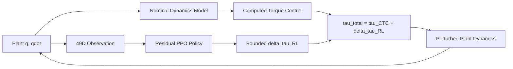
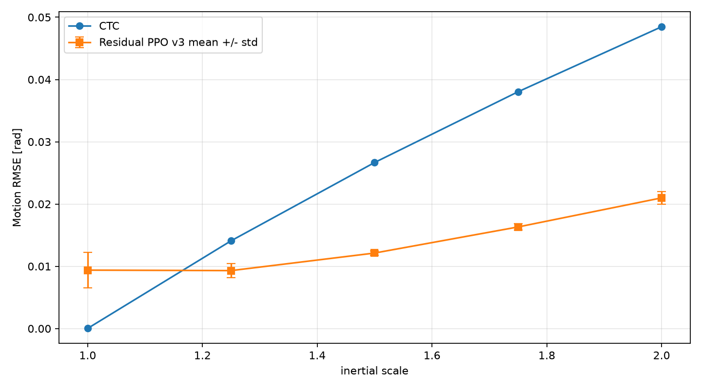

# 基于模型控制与残差强化学习的机械臂鲁棒轨迹跟踪

[English](README.md) | [简体中文](README_zh-CN.md)

MuJoCo 机械臂控制与 Residual RL 鲁棒轨迹跟踪项目。

本项目研究一个限幅 Residual PPO 策略能否在保留基于模型的计算力矩控制（Computed Torque Control, CTC）作为主控制器的前提下，补偿由惯性模型失配引起的轨迹跟踪误差。

## Quick View

| 项目 | 内容 |
|---|---|
| 机器人 | Franka Panda 风格 7 自由度机械臂 |
| 仿真器 | MuJoCo；力矩级模型来自 MuJoCo Menagerie |
| 名义控制器 | 使用 MuJoCo 质量矩阵与偏置项的计算力矩控制（CTC） |
| RL 策略 | 限幅 7 维 Residual PPO 残差力矩补偿 |
| 模型失配 | 末端惯性 scale 从 `1.25` 到 `2.00` |
| 主要结果 | 3 个随机种子下，`1.50` 到 `2.00` 失配场景 motion RMSE 平均降低 `54.52%` 到 `57.09%` |
| 方法边界 | 仅仿真；残差策略会使近乎完美的名义场景退化 |

## 项目概述

在动力学模型准确时，CTC 可以非常精确地跟踪关节轨迹。但当被控对象和名义模型存在失配，尤其是末端惯性失配时，同一个名义控制器会明显退化。

最终控制器为：

```text
tau_total = tau_CTC + delta_tau_RL
```

CTC 仍然是主控制器。PPO 只输出一个受限的残差力矩修正，并且策略不能观察真实被控对象的惯性 scale。

## 核心思路



项目有意区分被控对象模型与名义动力学模型。失配实验中扰动的是被控对象惯性，而控制器仍基于名义模型计算逆动力学。

## 经典控制基础

项目按阶段构建控制栈：

- 基于 MuJoCo Menagerie 派生的 direct-torque Panda 模型
- 关节空间 PD 与 PD + 重力补偿
- HOME -> TARGET -> HOME 五次多项式轨迹跟踪
- 使用 MuJoCo 质量矩阵与偏置项的计算力矩控制（CTC）
- 双模型 model-mismatch benchmark
- 作为经典控制探索的可选 Cartesian impedance 模块

## 模型失配基准

名义 CTC 几乎完美：

```text
Nominal overall RMSE = 2.389e-05 rad
Nominal motion RMSE  = 2.792e-05 rad
```

末端惯性失配会导致 CTC 明显退化：

| Inertial scale | CTC overall RMSE | CTC motion RMSE |
|---:|---:|---:|
| 1.00 | 0.00002389 | 0.00002792 |
| 1.25 | 0.01368397 | 0.01410428 |
| 1.50 | 0.02591773 | 0.02667415 |
| 1.75 | 0.03700884 | 0.03803673 |
| 2.00 | 0.04722092 | 0.04847359 |

名义模型不会随被控对象扰动而改变。

## Residual PPO

最终算法：Residual PPO v3。

49 维观测：

```text
q, qdot, q_des, qdot_des, qddot_des, q_des - q, qdot_des - qdot
```

动作：

```text
7D normalized residual action in [-1, 1]
```

残差力矩限幅：

```python
[8.0, 8.0, 8.0, 8.0, 1.2, 1.2, 1.2]  # Nm
```

训练分布：

```text
P(scale = 1.00) = 0.25
P(scale ~ Uniform(1.25, 1.75)) = 0.75
```

奖励：

```text
reward =
    - 1.0   * p_position
    - 0.1   * p_velocity
    - 0.03  * p_action
    - 0.005 * p_smooth
```

## 最终 3-Seed 结果

随机种子：`7, 17, 27`。所有结果使用固定预算 final model，而不是 best-checkpoint selection。



| Scale | CTC motion RMSE | Residual PPO mean | Residual PPO std | Mean improvement |
|---:|---:|---:|---:|---:|
| 1.00 | 0.00002792 | 0.00938740 | 0.00286179 | nominal n/a |
| 1.25 | 0.01410428 | 0.00931118 | 0.00113405 | 33.98 +/- 8.04% |
| 1.50 | 0.02667415 | 0.01213153 | 0.00036747 | 54.52 +/- 1.38% |
| 1.75 | 0.03803673 | 0.01632130 | 0.00049746 | 57.09 +/- 1.31% |
| 2.00 | 0.04847359 | 0.02099074 | 0.00098092 | 56.70 +/- 2.02% |

逐 seed motion RMSE：

| Scale | Seed 7 | Seed 17 | Seed 27 |
|---:|---:|---:|---:|
| 1.00 | 0.00867985 | 0.01253659 | 0.00694576 |
| 1.25 | 0.00885348 | 0.01060255 | 0.00847750 |
| 1.50 | 0.01198066 | 0.01255042 | 0.01186351 |
| 1.75 | 0.01626917 | 0.01684278 | 0.01585196 |
| 2.00 | 0.02092464 | 0.02200304 | 0.02004454 |

## 结果解释

Residual PPO 在中高强度惯性失配下，三个 seed 均优于 CTC：

- `scale=1.50`：所有 seed 均优于 CTC，平均提升 `54.52 +/- 1.38%`
- `scale=1.75`：所有 seed 均优于 CTC，平均提升 `57.09 +/- 1.31%`
- `scale=2.00`：在训练范围外仍然优于 CTC，平均提升 `56.70 +/- 2.02%`

残差力矩相对总力矩保持较小。在 `scale=1.50` 时，residual RMS / total torque RMS 平均约为 `4.48%`。最终确定性评估中没有出现 total torque clipping 或 residual action saturation。

## 已知限制：Nominal-Policy Interference

在 `scale=1.00` 时，名义 CTC 已接近完美。Residual PPO 仍会输出非零残差力矩，因此表现差于 CTC：

```text
CTC motion RMSE                 = 0.00002792
Residual PPO mean motion RMSE   = 0.00938740 +/- 0.00286179
Nominal safety guard            = 0.005 rad
Guard-passing seeds             = 0 / 3
```

该限制没有被隐藏。加入 nominal episodes 与动作正则化在开发过程中降低了这一问题，但最终 memoryless policy 没有完全消除 nominal interference。

未实现的潜在后续工作包括：

- history-based 或 recurrent residual policy
- 显式在线系统辨识
- 更广但受控的不确定性估计

## 开发记录

Residual PPO 开发在 v3 后有意停止：

- v1 只在 mismatch 上训练，导致 nominal tracking 明显退化
- v2 加入 nominal episodes，降低 nominal degradation
- v3 将 residual action regularization 从 `0.01` 提高到 `0.03`
- nominal interference 被降低但没有完全消除，因此作为限制报告，而不是继续调 reward

## 仓库结构

```text
robot_control_mujoco/
├── controllers/
├── trajectories/
├── envs/
├── robustness/
├── train/
├── evaluate/
├── experiments/
├── scripts/
├── tools/
├── docs/
├── results/
├── README.md
├── README_zh-CN.md
├── requirements.txt
└── .gitignore
```

## 安装

已在 Python 3.11 与 MuJoCo 3.11.0 下测试。

```bash
conda create -n robot_control_mujoco python=3.11
conda activate robot_control_mujoco
pip install -r requirements.txt
```

Panda 模型来自 MuJoCo Menagerie。将 Menagerie 克隆到常规 Git 跟踪之外：

```bash
mkdir -p assets
git clone https://github.com/google-deepmind/mujoco_menagerie.git assets/mujoco_menagerie
python tools/prepare_torque_model.py
```

不要修改 upstream Menagerie 文件。生成的 torque model 保留 Panda 模型目录中的来源 attribution 文件。

## 复现

准备 torque model：

```bash
python tools/prepare_torque_model.py
```

验证核心动力学：

```bash
python scripts/validate_dual_model_ctc.py
python scripts/validate_residual_env_v3.py
```

运行最终多 seed 评估，仅训练缺失的 seed artifacts：

```bash
python scripts/reproduce_final_results.py --train-missing --seeds 7 17 27
```

只聚合已有结果：

```bash
python scripts/reproduce_final_results.py --evaluate-only --seeds 7 17 27
```

## 结果产物

最终公开展示产物：

- `results/final_multiseed/aggregate/final_results.json`
- `results/final_multiseed/aggregate/final_results.csv`
- `results/final_multiseed/aggregate/per_seed_results.csv`
- `results/final_multiseed/aggregate/rmse_vs_inertial_scale_multiseed.png`
- `results/final_multiseed/aggregate/tracking_error_scale_150.png`
- `results/final_multiseed/aggregate/tracking_error_scale_200.png`
- `results/final_multiseed/aggregate/residual_torque_scale_150.png`
- `results/final_multiseed/aggregate/multiseed_improvement.png`

checkpoints、TensorBoard logs 与 raw rollout NPZ files 可复现，默认不纳入 GitHub。

## Limitations

- 仅仿真
- 不声称 Sim2Real
- 最终 Residual PPO 只使用一种明确的 model-mismatch family：末端惯性失配
- 没有 broad dynamics randomization
- memoryless residual policy
- nominal-policy interference 仍然存在
- 不声称形式化稳定性保证

## Acknowledgements

本项目使用 MuJoCo、MuJoCo Menagerie、Franka Panda model、Gymnasium、Stable-Baselines3、PyTorch、NumPy 与 Matplotlib。

用户尚未为本仓库选择 license。
